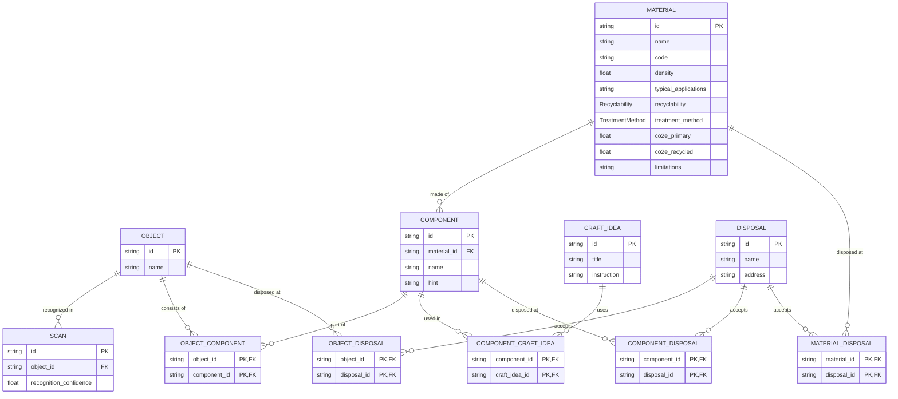

```mermaid
erDiagram
    OBJECT ||--o{ SCAN : "recognized in"
    OBJECT ||--o{ OBJECT_COMPONENT : "consists of"
    COMPONENT ||--o{ OBJECT_COMPONENT : "part of"
    MATERIAL ||--o{ COMPONENT : "made of"
    COMPONENT ||--o{ COMPONENT_CRAFT_IDEA : "used in"
    CRAFT_IDEA ||--o{ COMPONENT_CRAFT_IDEA : uses
    OBJECT ||--o{ OBJECT_DISPOSAL : "disposed at"
    COMPONENT ||--o{ COMPONENT_DISPOSAL : "disposed at"
    MATERIAL ||--o{ MATERIAL_DISPOSAL : "disposed at"
    DISPOSAL ||--o{ OBJECT_DISPOSAL : accepts
    DISPOSAL ||--o{ COMPONENT_DISPOSAL : accepts
    DISPOSAL ||--o{ MATERIAL_DISPOSAL : accepts
    SCAN {
        string id PK
        string object_id FK
        float recognition_confidence
    }
    OBJECT {
        string id PK
        string name
    }
    OBJECT_COMPONENT {
        string object_id PK, FK
        string component_id PK, FK
    }
    COMPONENT {
        string id PK
        string material_id FK
        string name
        string hint
    }
    MATERIAL {
        string id PK
        string name
        string code
        float density
        string typical_applications
        Recyclability recyclability
        TreatmentMethod treatment_method
        float co2e_primary
        float co2e_recycled
        string limitations
    }
    COMPONENT_CRAFT_IDEA {
        string component_id PK, FK
        string craft_idea_id PK, FK
    }
    CRAFT_IDEA {
        string id PK
        string title
        string instruction
    }
    OBJECT_DISPOSAL {
        string object_id PK, FK
        string disposal_id PK, FK
    }
    COMPONENT_DISPOSAL {
        string component_id PK, FK
        string disposal_id PK, FK
    }
    MATERIAL_DISPOSAL {
        string material_id PK, FK
        string disposal_id PK, FK
    }
    DISPOSAL {
        string id PK
        string name
        string address
    }
```

```
Recyclability
  none
  low
  medium
  high

TreatmentMethod
  energy_recovery
  mechanical_recycling
  paper_recycling
  remelting
```
